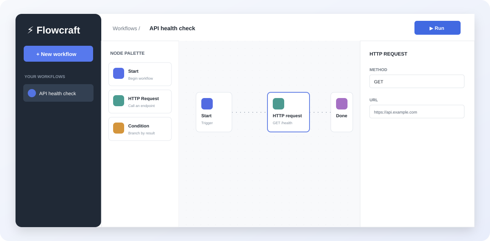

# Flowcraft Frontend

React-приложение для проектирования и запуска workflow. Собрано на Vite, TypeScript, SCSS, Redux Toolkit и TanStack Query; структура следует FSD.



## Возможности

- визуальный редактор узлов Start, HTTP, Condition и Result;
- drag-and-drop, соединения, масштабирование, undo/redo;
- шаблоны, импорт и экспорт JSON;
- валидация, запуск и история выполнения;
- регистрация, вход и работа с защищённым API;
- кэширование статических ассетов через nginx в production-сборке.

## Локальная разработка

Требуется Node.js 22+.

```bash
npm ci
npm run dev
```

Vite запустит приложение на `http://localhost:5173`. Чтобы обращаться к backend напрямую, создайте `.env` из `.env.example` и задайте:

```env
VITE_API_URL=http://localhost:8081
```

Без `VITE_API_URL` frontend обращается к `/api`, что подходит для nginx в Docker Compose.

## Команды

```bash
npm run lint
npm run lint:fix
npm run format
npm run format:check
npm run build
npm run preview
npm run test:e2e
```

E2E-тесты запускаются в Chromium через Playwright. Перед первым локальным запуском установите браузер: `npx playwright install chromium`.

## Pre-commit

Husky запускает `lint-staged` перед каждым коммитом: изменённые TypeScript/JavaScript-файлы проходят ESLint и Prettier, а SCSS, JSON, Markdown и YAML — Prettier. После первого `git init` выполните `npm install`, чтобы активировать hook.

## Production-запуск

Для запуска frontend вместе с API и PostgreSQL используйте Docker Compose из корня проекта:

```bash
docker compose up --build
```

Приложение будет доступно на `http://localhost:8080`. Nginx проксирует `/api` в backend. Документация API находится в [backend/README.md](backend/README.md).

## Документация кода

Документация серверного API генерируется Doxygen из JavaDoc-совместимых комментариев.
При установленном Doxygen выполните из корня репозитория:

```bash
cd docs/doxygen
doxygen Doxyfile
```

HTML и RTF-результаты появятся в `docs/doxygen/output/`.

## Структура

```text
src/
  app/          # providers, Redux store
  pages/        # страницы
  widgets/      # композиционные блоки интерфейса
  features/     # сценарии редактора и авторизация
  entities/     # модель и API workflow
  shared/       # HTTP-клиент, стили, утилиты
```
