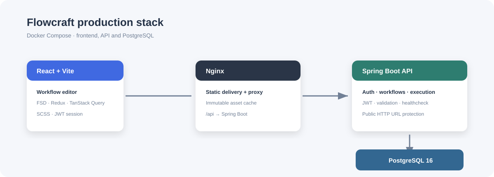

# Flowcraft API

Spring Boot 3 API для авторизации, хранения workflow и их выполнения. Использует Java 21, Spring Security, JPA и PostgreSQL 16.



## Запуск

Проще всего запустить API вместе с остальными сервисами из корня репозитория:

```bash
docker compose up --build
```

API доступен по `http://localhost:8081`, healthcheck — `GET /actuator/health`.

Контейнер автоматически создаёт таблицы `users` и `workflows`. Схема находится в [schema.sql](src/main/resources/schema.sql).

## Конфигурация

| Переменная                    | По умолчанию                               | Назначение                                |
| ----------------------------- | ------------------------------------------ | ----------------------------------------- |
| `DB_URL`                      | `jdbc:postgresql://postgres:5432/workflow` | JDBC URL PostgreSQL                       |
| `DB_USERNAME`                 | `workflow`                                 | Пользователь БД                           |
| `DB_PASSWORD`                 | `workflow`                                 | Пароль БД                                 |
| `JWT_SECRET`                  | development secret                         | Секрет подписи JWT                        |
| `JWT_EXPIRATION_MINUTES`      | `15`                                       | Время жизни access token                  |
| `JWT_REFRESH_EXPIRATION_DAYS` | `7`                                        | Время жизни refresh token                 |
| `AUTH_COOKIE_SECURE`          | `false`                                    | Передавать refresh cookie только по HTTPS |

В production обязательно задайте случайный `JWT_SECRET` длиной не менее 32 байт, собственный `POSTGRES_PASSWORD` и `AUTH_COOKIE_SECURE=true` в окружении Docker Compose. Access token живёт в памяти frontend, а refresh token хранится в HttpOnly cookie с `SameSite=Lax`.

## API

### Авторизация

| Метод  | Путь                 | Описание        |
| ------ | -------------------- | --------------- |
| `POST` | `/api/auth/register` | Создать аккаунт |
| `POST` | `/api/auth/login`    | Получить JWT    |

Тело запроса для обоих endpoints:

```json
{ "email": "user@example.com", "password": "strong-password" }
```

Последующие запросы требуют заголовок `Authorization: Bearer <accessToken>`.

| Метод  | Путь                | Описание                                         |
| ------ | ------------------- | ------------------------------------------------ |
| `POST` | `/api/auth/refresh` | Обновить access token из HttpOnly refresh cookie |
| `POST` | `/api/auth/logout`  | Отозвать refresh cookie                          |

### Workflow

| Метод    | Путь                             | Описание                              |
| -------- | -------------------------------- | ------------------------------------- |
| `GET`    | `/api/workflows`                 | Список workflow текущего пользователя |
| `POST`   | `/api/workflows`                 | Создать workflow                      |
| `GET`    | `/api/workflows/{id}`            | Получить workflow                     |
| `PUT`    | `/api/workflows/{id}`            | Сохранить workflow                    |
| `DELETE` | `/api/workflows/{id}`            | Удалить workflow                      |
| `POST`   | `/api/workflows/{id}/validate`   | Проверить граф                        |
| `POST`   | `/api/workflows/{id}/execute`    | Выполнить граф                        |
| `GET`    | `/api/workflows/{id}/executions` | История запусков                      |
| `GET`    | `/api/executions/{id}`           | Статус запуска                        |

Исполнитель HTTP-узлов разрешает только публичные `http` и `https` URL. Адреса localhost, link-local и private networks блокируются.

## Надёжность и наблюдаемость

- Auth endpoints ограничены десятью запросами на IP в минуту; при превышении API возвращает `429` и `Retry-After`.
- API логирует метод, путь, HTTP-статус и длительность каждого запроса без тел запросов и токенов.
- Actuator предоставляет `/actuator/health`, `/actuator/info` и `/actuator/metrics`; Docker Compose использует healthcheck API.

## Docker

Образ собирается двухэтапным Dockerfile: Maven собирает JAR, затем Java JRE запускает минимальный runtime-образ. Для отдельной сборки:

```bash
docker build -t flowcraft-api ./backend
```
